# Visual Direction Options — Real-World References

Three visual directions pulled from **real, shipped nutrition/health app screens**, each checked against [`01-research/04-conclusions.md`](../01-research/04-conclusions.md) and [`01-research/02-audience-5w.md`](../01-research/02-audience-5w.md). Companion moodboard: [`01-direction-options.html`](01-direction-options.html).

**No direction is selected in this document.** It's input for that decision.

---

## Method & limits

- **Sources:** Mobbin public screen pages (12 screens used, 14 reviewed). I tried Refero too: its Food & Drink category lists relevant apps (FoodNoms, Foodvisor, Kitchen Stories, Mela, Crouton, Julienne), but the search was deliberately kept tight and no Refero screens were reviewed or used. Dribbble/Behance weren't needed.
- **Directions are what the references actually showed**, not categories picked in advance. They landed on roughly *clinical / warm-editorial / bold-coach*.
- **Palettes were sampled from pixels**, not eyeballed. I decoded the downloaded screenshots and ranked quantized colors by share, so hex values are accurate to within about ±6 per channel.
- **Typefaces are described, not identified.** Screens don't reveal font names, so the notes say "reads as" / "resembles".
- **Known gap:** none of the 12 screens shows food photography or a recipe-browsing layout. This matches research H3: recipe discovery isn't a headline feature at any incumbent, so their UI has little to show for it. Whichever direction is chosen will need its recipe surfaces designed without a close reference. That's a judgment call, not something this set evidences.
- Local copies of every screen are in [`refs/`](refs/). The HTML embeds them from Mobbin's CDN and falls back to these copies.

---

## Direction A — Clinical Ledger

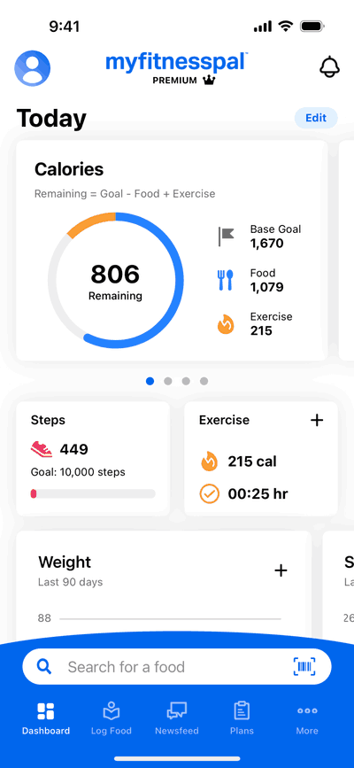 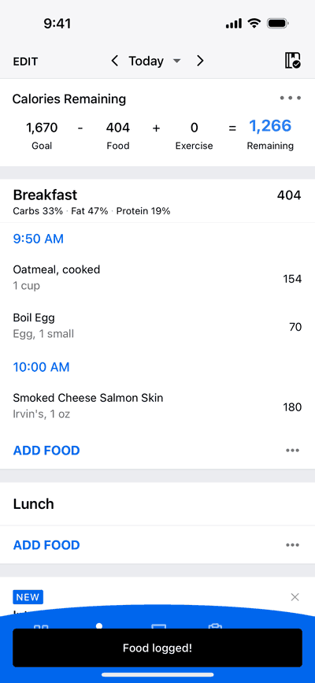 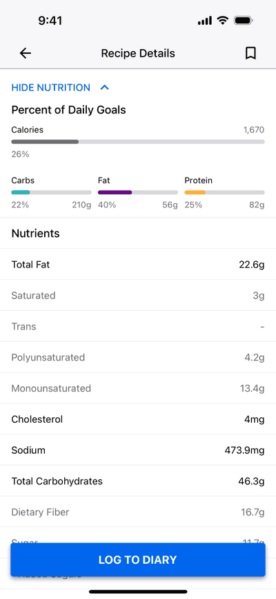 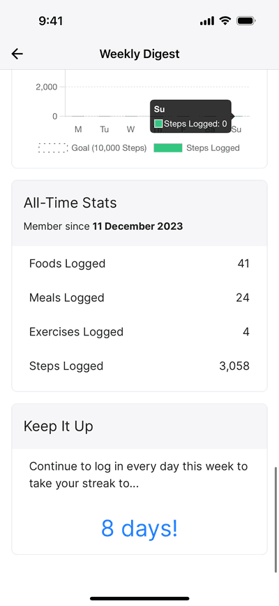

| # | Screen | Source |
|---|---|---|
| A1 | MyFitnessPal — Today dashboard (calorie ring, persistent food search + barcode bar) | [Mobbin](https://mobbin.com/explore/screens/d5384da7-036e-4ed6-94d6-36e5a35a2f8a) |
| A2 | MyFitnessPal — Food log (Goal − Food + Exercise = Remaining equation) | [Mobbin](https://mobbin.com/explore/screens/9b6f1db6-6432-45d2-be77-fc4d7dde8130) |
| A3 | MyFitnessPal — Recipe details / nutrients with sticky "Log to diary" | [Mobbin](https://mobbin.com/explore/screens/e8467de9-aaf9-43c2-8576-5ba52c87230a) |
| A4 | MyFitnessPal — Weekly digest, all-time stats | [Mobbin](https://mobbin.com/explore/screens/012bb79b-4453-4e02-9a58-9b3023463f4b) |

**Mood / aesthetic.** A spreadsheet in a phone: white grouped lists on light gray, hairline dividers, and every number right-aligned in its own column. Color is used almost only for meaning: one saturated blue for actions and totals, plus small tinted bars for macros. It reads as institutional, complete and auditable, never decorative.

**Palette (sampled)**

| Hex | Role observed |
|---|---|
| `#0066EA` | Single action color — text buttons, primary CTA, tab bar, "Remaining" total (5–13% of pixels) |
| `#FCFCFC` | Card / list surface (62–76%) |
| `#EAEAF0` | Grouped-section gutters and dividers |
| `#000000` | Ink — food names, all numerals |

Secondary data accents (teal / purple / amber macro bars on A3) show up only as tiny slivers.

**Typography.** iOS system sans (SF Pro) throughout, with hierarchy carried by weight and gray, not size: semibold section heads ("Breakfast"), regular item names, gray serving sub-lines ("1 cup"). Numerals sit flush right in columns and scan like a ledger. Text buttons are all caps in blue with slight tracking ("ADD FOOD", "HIDE NUTRITION"). Only the dashboard breaks scale, with a large bold "Today" title and a bold numeral inside the ring.

**Against the research**

| Pros | Cons |
|---|---|
| **H2 (trust = accuracy):** it's the most transparent idiom of the three. Showing the arithmetic (A2's equation row) and full nutrient tables (A3) makes numbers checkable, which fits Segment 1 and Segment 3's need to "trust my numbers without redoing the math". | **It *is* the incumbent's look.** Segment 1 are "experienced switchers… burned by" MyFitnessPal/Lose It!. Looking like MFP signals "same product". A1 even has a **PREMIUM crown in the header**, and paywalling is research's loudest betrayal signal (H2). |
| **H1 / IA "logging one action away":** A1's docked "Search for a food" + barcode bar is exactly the always-reachable entry point the IA direction calls for. | **Weak for H3 (recipe discovery).** Nothing here creates appetite or confidence to *cook*. Segment 2 is "less numerically obsessive" and already leaves apps for recipe blogs, and a gray nutrient table won't keep them. |
| **H4 precedent:** A3 is literally a recipe detail that resolves into a sticky "LOG TO DIARY" button, a real-world pattern for "a recipe can never be a dead end". | **The "chore" risk (H1):** long gray lists and small all-caps links make daily logging feel like bookkeeping, the feeling Segment 1 abandons tools over. |
| Cheapest to systematize (system type, one accent, list components), which fits the brief's "minimize manual work". | All four references come from one app, so this is partly one company's house style rather than a broad category aesthetic, and gives little room to differentiate. |

---

## Direction B — Oat & Serif (warm editorial wellness)

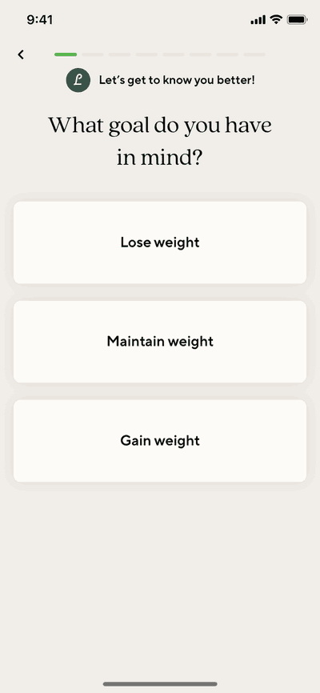 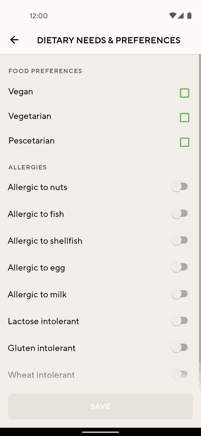 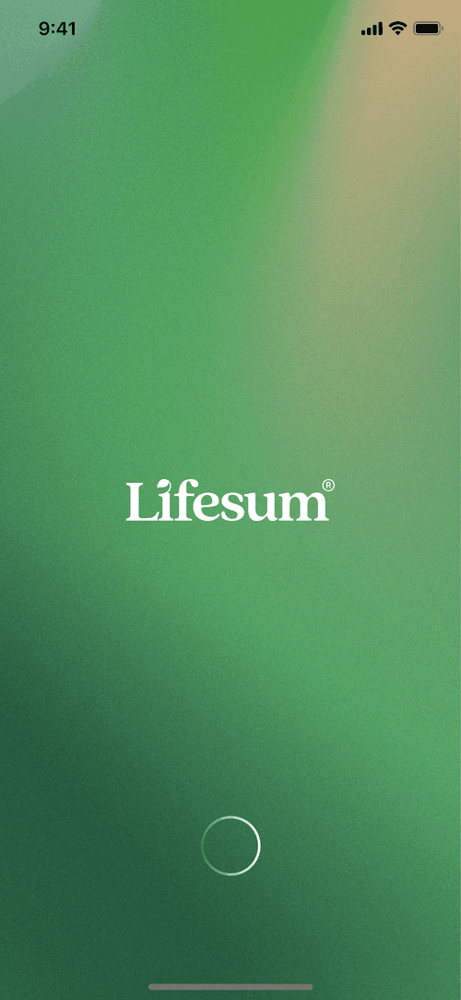 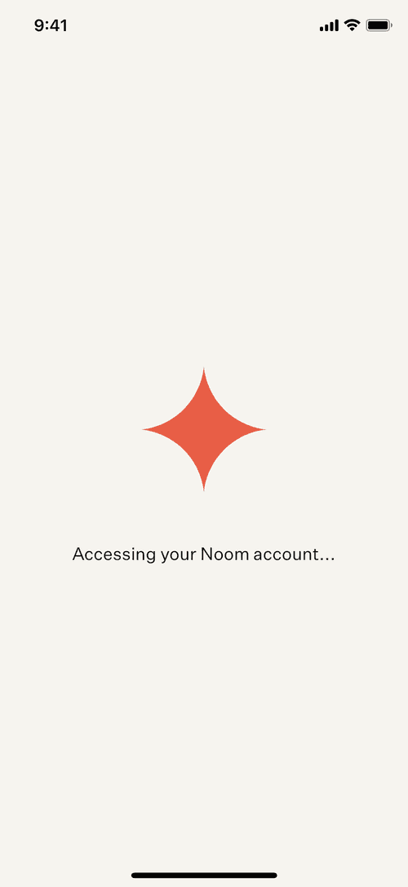

| # | Screen | Source |
|---|---|---|
| B1 | Lifesum — Onboarding "What goal do you have in mind?" | [Mobbin](https://mobbin.com/screens/234cc9c8-7503-4b05-93a3-16ab472792db) |
| B2 | Lifesum (Android) — Dietary needs & preferences (diet tags + allergies) | [Mobbin](https://mobbin.com/screens/9f8ab1ea-c8d7-4ed5-80d7-ff11e56b2f48) |
| B3 | Lifesum — Launch screen, green gradient + serif wordmark | [Mobbin](https://mobbin.com/screens/cffdd600-8e10-4cac-b0c4-09e0cc8b597c) |
| B4 | Noom — Account loading state, coral mark on cream | [Mobbin](https://mobbin.com/screens/1a6ccb50-9583-46e8-85f3-2d86e55c7543) |

**Mood / aesthetic.** Calm, magazine-like wellness. Warm oat and cream grounds replace white, cards are barely lighter than the page and float on soft shadow, and there's a lot of empty space around one question at a time. Color comes from nature (leaf and pine greens, a grainy gradient) with a single warm coral accent. It feels like a cookbook or a slow-living brand more than a tool.

**Palette (sampled)**

| Hex | Role observed |
|---|---|
| `#F0EAE4` | Oat page ground (55–72% of B1/B2); Noom's cream `#F6F0EA` is nearly identical |
| `#364E48` | Deep pine — avatar badge, darkest brand tone (B3 gradient runs down to `#245A3C`) |
| `#54B44E` | Leaf green — progress bar, checkboxes, gradient mid-tone `#4E9C60` |
| `#E45A42` | Coral — Noom's single brand mark |

**Typography.** A high-contrast transitional serif, in regular weight and centered, carries the voice ("What goal do you have in mind?"), and the Lifesum wordmark is a serif with a leaf-shaped i-dot. Working UI switches to a clean geometric sans in semibold for choices ("Lose weight"). Section labels are small, widely tracked all caps ("FOOD PREFERENCES", "ALLERGIES"). Noom's loading line is a light, slightly tracked grotesk. The overall pairing is editorial serif for voice plus neutral sans for controls.

**Against the research**

| Pros | Cons |
|---|---|
| **Segment 2 & H3:** the home cook wants "eating right for me" and "confidence *before* cooking", in planning moments on the couch or commute. An editorial, cookbook tone is the most natural host for recipe discovery as a first-class section. | **H1 (speed, one-handed glance):** low-contrast surfaces (card `#FCF6F6` on `#F0EAE4` is nearly 1:1, with edges held only by shadow) and airy one-question layouts slow the in-the-moment log Segment 1 does several times a day. |
| **IA "profile of me set once":** B2 is almost exactly the diet-tag + allergy profile that must feed both targets and recipe filters (P0 #5, P1 #6), proof the pattern reads well in this style. | **H2 (trust in numbers):** serif and soft-wellness tone can read as approximate or aspirational. Segment 1 and Segment 3 need precise macros, and this direction has no reference for dense numeric UI. That would have to be invented. |
| **Distance from the clinical-blue incumbents** (MFP, Lose It!) without going gimmicky, which suits "eating right" over "hitting a number". | **Paywall association:** Lifesum's own subscription screen (seen during this search, not used) lists Free last under discounted plans. The warm style isn't the problem, but copying Lifesum wholesale borrows its reputation. |
| Serif + sans pairing gives the brand an ownable voice cheaply (two typefaces, a small palette). | **Category cliché risk:** beige + sage/leaf green + serif is a crowded "wellness" look, so differentiation must come from product (H4), not the palette. |

---

## Direction C — Bold Coach (high-contrast, playful energy)

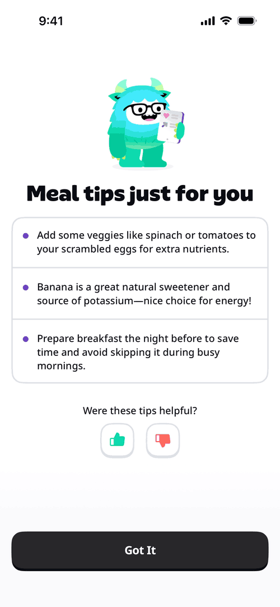 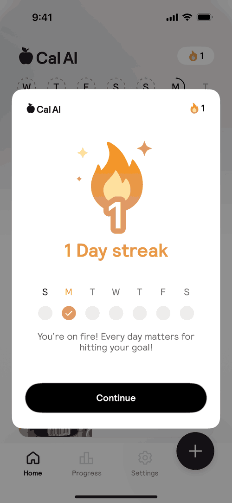 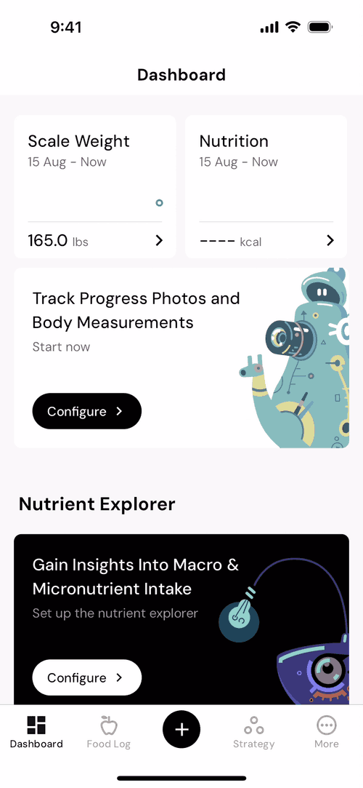 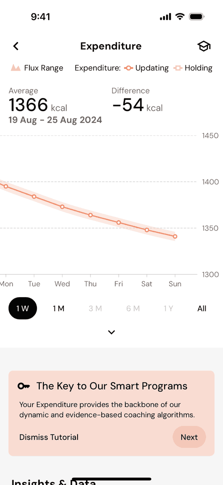

| # | Screen | Source |
|---|---|---|
| C1 | Yazio — "Meal tips just for you" with mascot | [Mobbin](https://mobbin.com/explore/screens/8bb9fc32-9cf8-46f9-95e3-9eb43bf38731) |
| C2 | Cal AI — 1-day streak celebration modal | [Mobbin](https://mobbin.com/explore/screens/839a4e83-1af4-427a-bf1d-31b7608214bd) |
| C3 | MacroFactor — Dashboard with illustrated robot cards, black CTAs | [Mobbin](https://mobbin.com/explore/screens/c82256d1-7c67-4bb8-bc51-86bc460c79ef) |
| C4 | MacroFactor — Expenditure chart, big numerals, black segmented pill | [Mobbin](https://mobbin.com/explore/screens/2cc3f680-2069-4da9-ad0a-af70a958dc2a) |

**Mood / aesthetic.** Confident and motivational: a stark black-and-white base (black pill buttons, black feature cards, 18% black pixels on C3) punctuated by one warm energetic hue and occasional character illustration. Numbers and headlines are big and heavy, so they read at arm's length. It's a coach cheering you on rather than a ledger or a cookbook.

**Palette (sampled)**

| Hex | Role observed |
|---|---|
| `#000000` | Primary CTA pills, feature cards, active segment (C3/C4); Yazio uses a softer `#24242A` |
| `#F6F6F6` | Page ground behind white cards (`#FCFCFC`) |
| `#E49642` | Warm amber — streak flame and headline (C2); MacroFactor's coral `#F0906C` is the same family |
| `#0CD8AE` | Electric mint — Yazio mascot and thumbs-up (C1) |

**Typography.** Display type is very heavy: Yazio's headline is an ultra-black, tightly spaced grotesque with near-rounded terminals, and Cal AI's "1 Day streak" is a bold rounded grotesk in amber. MacroFactor uses a friendly geometric sans (reads close to DM Sans) with **large light-weight numerals and a smaller unit** ("1366 kcal"), which is precise without feeling clinical. Buttons are bold white on black, and body copy is plain humanist sans at comfortable size.

**Against the research**

| Pros | Cons |
|---|---|
| **H1 (glanceable, one-handed):** maximum contrast plus oversized numerals make "does this fit my day?" readable in a second, and one black pill = one obvious next action, a clean base for a "log this" CTA (H4). | **Out of the audience's stated scope:** the 5W segments were deliberately built around the two stories, *not* "gamification". C1/C2 are engagement surfaces (tips, streaks), not the core loop. |
| **Segment 1 "visible, measurable progress":** momentum cues (streaks, trend charts) speak directly to the payoff trackers cite for sticking with logging. | **H2 (trust):** a mascot and celebratory tone can undercut perceived accuracy for experienced switchers. Cal AI is one of the three researched apps, and its AI-photo estimates were a top scrutiny point, so its playful skin doesn't carry trust. |
| **C4 shows data can be bold:** big light numerals + coral range chart = precision for Segment 3 without the spreadsheet feel of A. | **H3 (recipe discovery):** the mono black/white base does nothing for appetite. Food imagery would have to fight a stark UI. |
| Strongest distance from the blue-list incumbents, and the most memorable brand. | **Production cost:** custom character illustration (C1, C3) contradicts the brief's "minimize manual work". A mascot-free variant keeps the contrast but loses much of the personality. |

---

## Side-by-side

| Criterion (source) | A · Clinical Ledger | B · Oat & Serif | C · Bold Coach |
|---|---|---|---|
| Fast in-the-moment logging (H1, Seg 1) | Good (dense, docked search) | Weak (low contrast, airy) | **Strongest** (contrast, big numerals) |
| Trust in numbers (H2, Seg 1 & 3) | **Strongest** (transparent tables) | Weak (unproven for data) | Mixed (C4 good, mascot/streaks hurt) |
| Recipe discovery as first-class (H3, Seg 2) | Weak | **Strongest** | Weak |
| Recipe → log handoff (H4, Seg 3) | Direct precedent (A3) | Neutral | Good CTA base |
| Differentiation from paywall-happy incumbents (Seg 1 switchers) | Poor (is MFP) | Moderate (cliché risk) | Strong |
| Fits "minimize manual work" (brief) | **Cheapest** | Cheap | Costly if illustrated |

**What the comparison shows (judgment call, not a selection):** no single reference direction covers both user stories. A and C serve story 1 and B serves story 2, which mirrors research's finding that incumbents treat recipes as secondary. The choice is really about which weakness is cheaper to fix inside the design system. One option is a numerically rigorous base (A's transparency or C4's bold numerals) given warmth for recipe surfaces. The other is a warm base (B) given a sharper, higher-contrast data layer.
